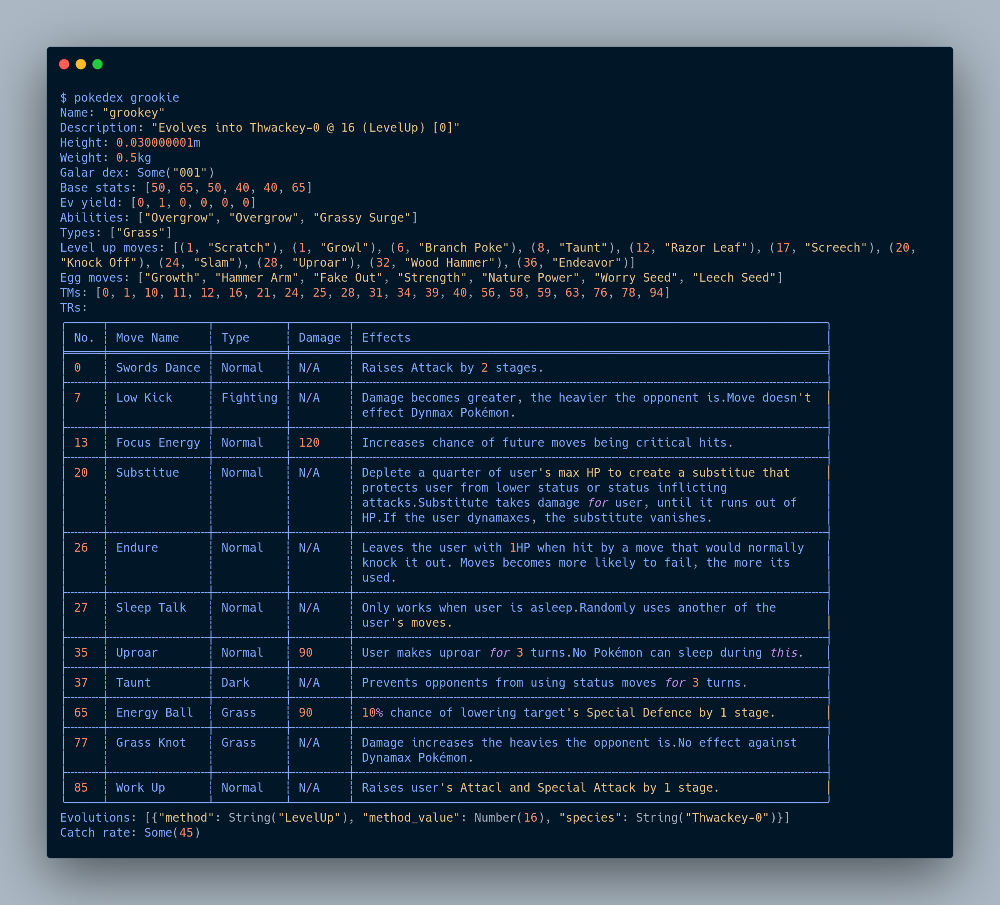

# 🧢 pokemon-rs

<!--

If you _really_ want to use this tool, here's how:
-->
1. `git clone` 
2. `cd pokedex-rs && cargo install --path .`
3. On the command line, run `pokedex <name_of_pokemon>`
4. Profit

Current response format:

]

## License / Contributing

Project is MIT-licensed and can be used freely.

Not actively seeking PRs or Issues as I'm still learning the language.
